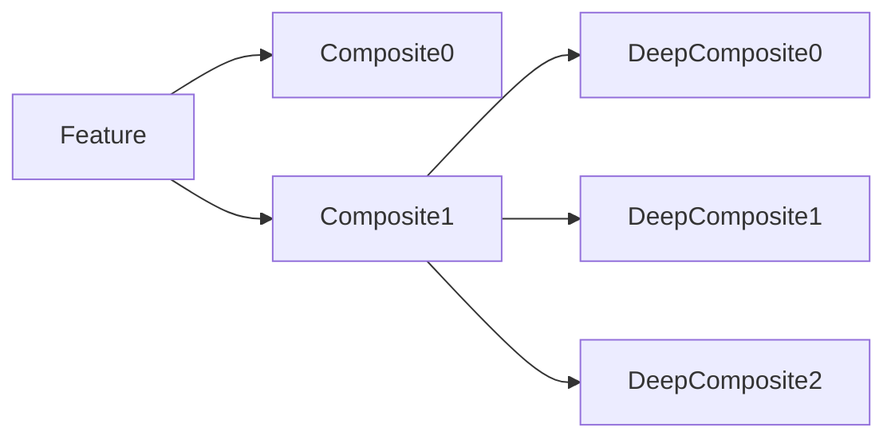
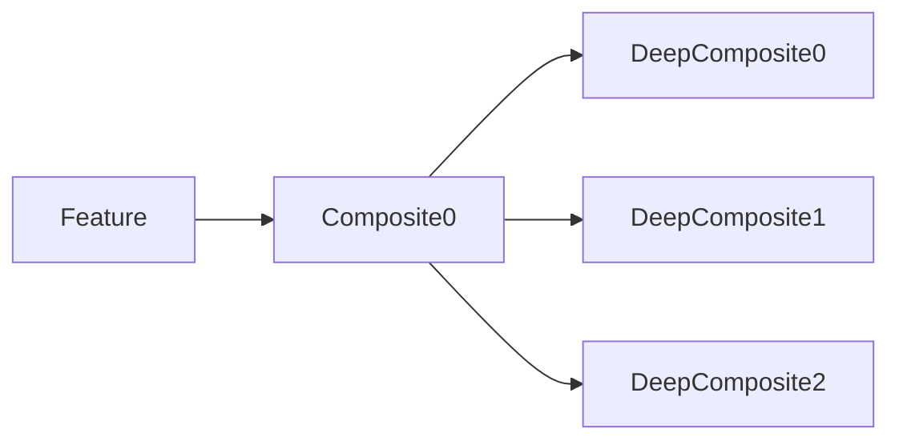

# Tree editor

1. Init should recrate and recync composites from this point onward

1. Update feature in  tree should destroy whole subtree from this point,
and then recreate and resync it from this point onward

1a) UpdateFeature -> recreate childreen -> sync composites

recrete childreen will destroy current controllers

2. Adding composite should 